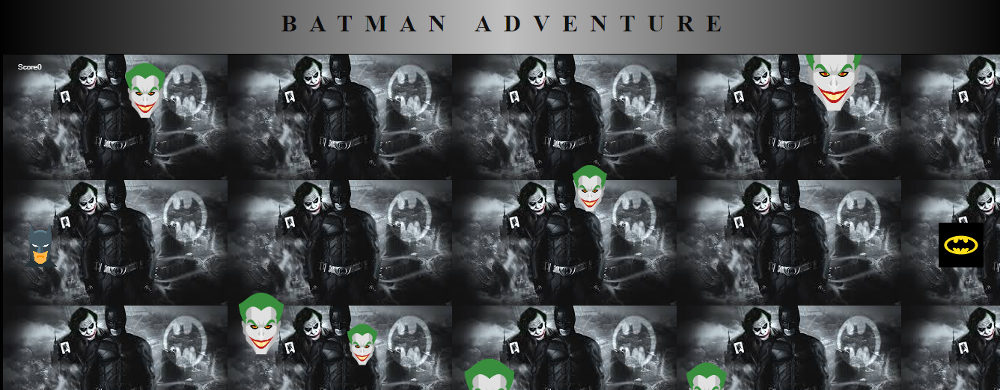
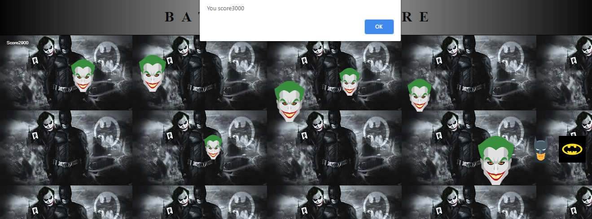

# Batman Vs Joker game
Batman wants its Logo while not touching joker.

# HTML
* Html file created.
* CSS file linked.
* Using canvas :-
  1. Determine the background image.
  2. Give border width.
* Heading given.
* Js file attached.

# CSS
* h1 tag
  1. Used font combination of Raleway and sans-serif.
* body
  1. Used linear-gradient to right for
  changing color combination from left to right.
# Java Script
* Function to add images.
  1. Images got from https://icons8.com/ .
* Determine the height and width of canvas.
* Assign coordinates(x,y) and size of joker hurdles , batman and batman logo.
* Use collide function to move the joker hurdles up and down upto height of canvas.
* Assign batman and batman logo intial and coordinates.
* Draw dunction to draw the size of all the joker hurles, batman and batman logo according  to their sizes.
* Update function to change the score after the movements of logo.
  1. Game over when score gets less than 0.
  2. Win when reached to the logo.
  
# Glimpse Of Game

  ## Glimpse 1
  

  ## Glimpse 2
  

  
